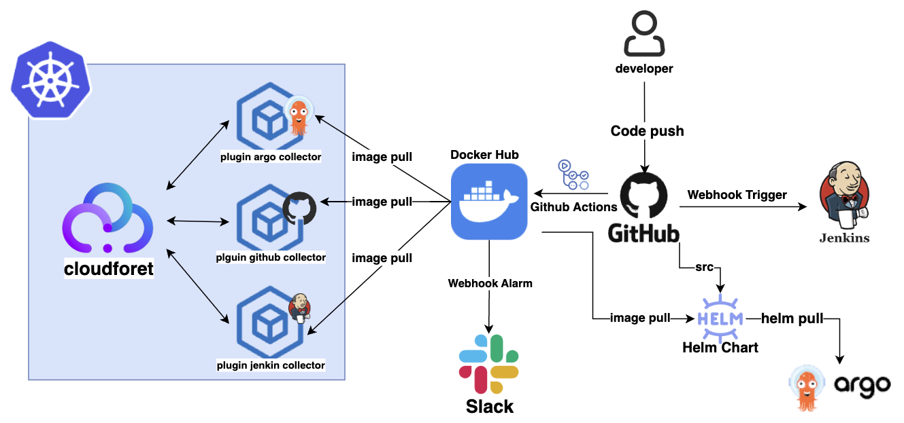
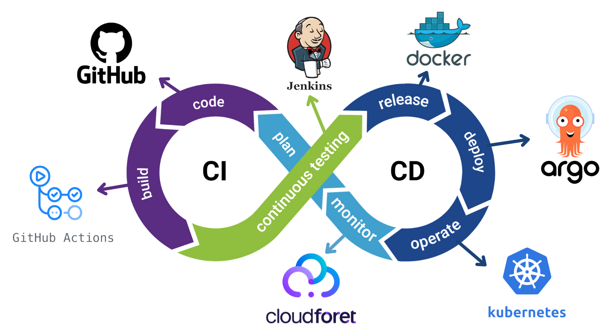

# 👋 Welcome to ChainsoMen's Plugin Repositories!

At ChainsoMen, we develop powerful plugins to collect and manage inventory data from various DevOps tools such as GitHub, Jenkins, and ArgoCD. 
Our goal is to streamline DevOps workflows by providing seamless integrations that help you manage your infrastructure with ease.

## 🔌 Our Repositories
Explore our collection of plugins that integrate with popular DevOps tools:

- **[plugin-github-inven-collector](https://github.com/ChainsoMen/plugin-github-inven-collector)**  
  A plugin designed to collect and manage GitHub repository and workflow data, ensuring a seamless integration into your DevOps pipeline.

- **[plugin-jenkins-inven-collector](https://github.com/ChainsoMen/plugin-jenkins-inven-collector)**  
  This plugin gathers Jenkins job information, including job configurations and pipeline scripts, for enhanced visibility and control.

- **[plugin-argo-inven-collector](https://github.com/ChainsoMen/plugin-argo-inven-collector)**  
  Collects and manages inventory data from ArgoCD, helping you stay on top of your GitOps-driven deployments.

## 🛠️ System Architecture
Below is the system architecture, illustrating the development and operational environments.

**Right Side (Development Environment):**
- The development process starts when a developer writes code.
- GitHub Actions is used to build and push the Docker image to Docker Hub.
- Any changes in the source trigger a webhook that activates Jenkins.
- ArgoCD tracks these changes to enable continuous integration and continuous deployment (CI/CD) in the development environment.

**Left Side (Kubernetes Operational Environment):**
- In the operational environment, Cloudforet pulls the images and integrates them as plugins, ensuring efficient deployment and management.

## ⛓️ DevOps Toolchain
We have visualized our system according to the CI/CD process, aligning with the theme of our project, DevOps Toolchain.  
We’re excited to see how the community will utilize and expand these plugins.
Stay tuned for more updates and new releases!

## 🎬 Demo

---

### 🧑‍💻 Join the Community
We encourage collaboration and idea-sharing! Connect with us through [Email](mailto:kr.public.wonjun@gmail.com) or contribute directly through pull requests.

### 💡 Useful Resources
[Documentation](https://docs.spaceone.megazone.io/ko/developers/setup/installing_spaceone/)  <- Comprehensive guides on how to use and extend our plugins.

### 🎉 Fun Fact
Did you know? Our entire development team is either currently studying or has graduated from Dongguk University with a degree in Computer Science! 🎓🐯

### 👥 Team Member
| Name | Github                     | Major                             |
|------|---------------------------|-----------------------------------|
| 조원준  | https://github.com/jun6292 | Computer Science Engineering |
| 김태욱  | https://github.com/ | Computer Science Engineering |
| 강우빈  | https://github.com/Shortood | Computer Science Engineering |
| 나찬진  | https://github.com/ckswls56 | Computer Science Engineering |

